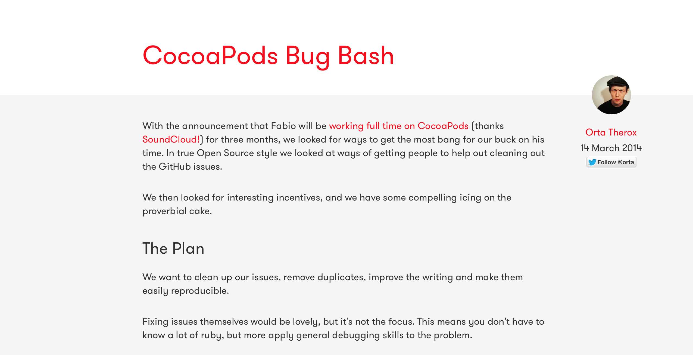

## 🚀  Start Contributing to CocoaPods

### CocoaPods 3rd WWDC Meetup, June 2014

## Boris Bügling - @NeoNacho

---

# Hi!

---

## Y U NO SUBMODULES?

---

# Last year

---

---

# Integral part of my workflow

---

---

- Random assignment of issues
- Super helpful team
- Leaderboard

---

# Rainforest

---

    $ git clone https://github.com/CocoaPods/Rainforest.git
    $ cd Rainforest
    $ rake bootstrap
    $ rake local_dependencies_set
    $ CocoaPods/bin/pod --help

---

- Core
- cocoapods-downloader
- Xcodeproj
- CocoaPods

---

# Core

    spec = Pod::Specification.from_file('CPDColors.podspec')
    puts spec.name
    puts spec.version

    $ ./core.rb 
	CPDColors
	0.1.0

---

# cocoapods-downloader

	def download_head!
		hg! %|clone #{url} #{@target_path.shellescape}| [...]
	end 

	def download_revision!
		hg! %|clone "#{url}" --rev '#{options[:revision]}' #{@target_path [...]
	end

	def download_tag!
		hg! %|clone "#{url}" --updaterev '#{options[:tag]}' #{@target_path [...]
	end 

---

# Xcodeproj

    wrkspace = Xcodeproj::Workspace.new_from_xcworkspace(
    	'CPDColors/Example/Demo.xcworkspace')
    puts wrkspace.schemes

    $ ./xcodeproj.rb 
    {"Demo"=>"/Users/boris/Projects/CPDColors/Example/Demo.xcodeproj", 
     "Pods"=>"/Users/boris/Projects/CPDColors/Example/Pods/Pods.xcodeproj"}

---

# CocoaPods

	$ pod install
	Analyzing dependencies
	Pre-downloading: `DBCamera` from `https://github.com/[...]`
	Downloading dependencies
	Installing ARASCIISwizzle (1.1.0)
	Installing Bolts (1.1.0)
	[...]
	Generating Pods project
	Integrating client project

---

# Ruby

    $ irb

- Interactive Ruby Shell

---

# Ruby

    irb(main):001:0> "Hello World"
    => "Hello World"

---

# Ruby

    irb(main):019:0> def h(name = "World")
    irb(main):020:1> puts "Hello #{name.capitalize}!"
    irb(main):021:1> end
    => :h
    irb(main):022:0> h "chris"
    Hello Chris!

---

# ruby

	irb(main):001:0> a
	NameError: undefined local variable or method `a' for main:Object
		from (irb):1
		from /usr/bin/irb:12:in `<main>'
	irb(main):002:0> a = b
	NameError: undefined local variable or method `b' for main:Object
		from (irb):2
		from /usr/bin/irb:12:in `<main>'
	irb(main):003:0> a = a
	=> nil

---

# Learning more about Ruby

- http://mislav.uniqpath.com/poignant-guide/
- https://www.ruby-lang.org/en/documentation/quickstart/

---

# Please use the system ruby!

---

# Thanks!

---

https://github.com/CocoaPods/Rainforest

---

