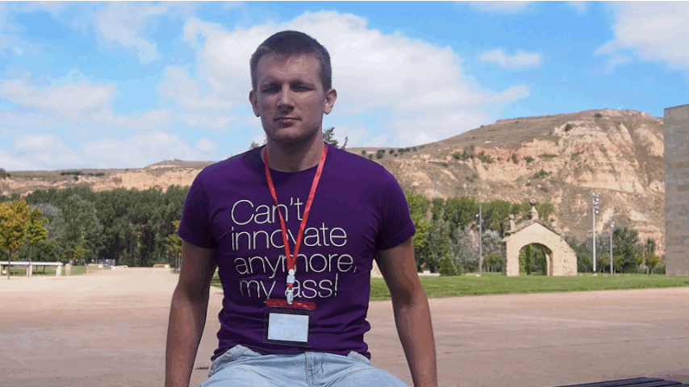

## 🚀  Start Contributing to CocoaPods

### CocoaPods 3rd WWDC Meetup, June 2014

## Boris Bügling - @NeoNacho

---

# Hi!

---

# Last year

---

---

# Integral part of my workflow

---

---

- Random assignment of issues
- Super helpful team
- Leaderboard

---

# Rainforest

---

    $ git clone https://github.com/CocoaPods/Rainforest.git
    $ cd Rainforest
    $ rake bootstrap
    $ rake local_dependencies_set
    $ CocoaPods/bin/pod --help

---

- Core
- cocoapods-downloader
- Xcodeproj
- CocoaPods

---

Super short intro to CocoaPods 1

---

Super short intro to CocoaPods 2

---

Super short intro to Ruby 1

---

Super short intro to Ruby 2

---

Super short intro to Ruby 3

---

Super short intro to Ruby 4

---

# Thanks!

---

https://github.com/CocoaPods/Rainforest

